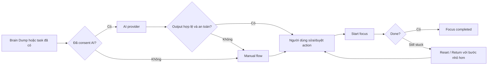

# Đặc tả mô-đun ứng dụng — Beneath the Pine

- **Trạng thái:** Draft
- **Phiên bản:** 1.0
- **Cập nhật:** 2026-08-20
- **Phạm vi:** Web responsive private beta và pilot nghiên cứu

## 1. Mục đích

Beneath the Pine hỗ trợ người đang bị quá tải hoặc “stuck” chuyển một ý nghĩ hay việc đang dang dở thành **một hành động nhỏ có thể bắt đầu trong khoảng 10 phút**. Đây là công cụ tự quản lý; không chẩn đoán, điều trị hoặc đưa tư vấn y khoa/tâm lý.

V1 không phải một trình quản lý công việc đầy đủ và không phải chatbot trò chuyện tự do. Người dùng luôn là người duyệt bất kỳ task hoặc next action nào được đề xuất.

## 2. Thành phần AI

V1 có **một mô hình sản phẩm riêng** cùng các chế độ chạy thay thế. “Inference service” là dịch vụ chạy mô hình, không phải một mô hình thứ hai.

| Thành phần | Loại | Trách nhiệm | Khi dùng |
|---|---|---|---|
| Beneath Pine AI v1 | Qwen2.5-1.5B-Instruct fine-tune QLoRA | Brain Dump Extraction và Help Me Start bằng tiếng Việt | Pilot intervention, demo local và khi inference service sẵn sàng |
| GGUF 4-bit | Bản quantized của model v1 | Chạy local bằng `llama.cpp`/`llama-cpp-python` trên máy demo | Khi có GPU phù hợp hoặc môi trường local đã chuẩn bị |
| ManualGrowthAssistant | Rule-based fallback | Đưa gợi ý có cấu trúc, an toàn khi model lỗi/offline | Mặc định phát triển, hoặc sau timeout/schema failure |
| OpenAI provider | Provider tùy chọn | Baseline kỹ thuật hoặc hỗ trợ môi trường phát triển | Không bắt buộc; không dùng làm điều kiện pilot model riêng |
| Weekly Review template | Rule/template, không fine-tune | Tóm tắt facts, một insight và một experiment cần duyệt | Theo yêu cầu chủ động của người dùng |

### 2.1 Hai capability được fine-tune

**Brain Dump Extraction** nhận văn bản tự do và chỉ trả về danh sách item có cấu trúc, các candidate next action và câu hỏi làm rõ tối thiểu. AI không được tự lưu task, tự đặt deadline hoặc suy đoán chẩn đoán.

**Help Me Start** nhận một task đã được người dùng chọn cùng thời gian/năng lượng tự nguyện cung cấp. AI trả về một hành động có động từ, cụ thể và đủ nhỏ để bắt đầu trong tối đa 15 phút; đồng thời có lựa chọn “nhỏ hơn nữa”.

### 2.2 Quy tắc chạy AI

- Backend là client duy nhất của inference service; web không được gọi model trực tiếp.
- Mọi output phải qua Zod/schema validation trước khi hiển thị hay lưu.
- Với model riêng: timeout, sau đó retry tối đa một lần nếu output không hợp lệ; nếu vẫn lỗi, chuyển manual fallback và nói rõ trạng thái với người dùng.
- Safety guardrail chạy ở backend trước model. Nội dung khủng hoảng dừng flow AI và hiển thị hướng dẫn tìm trợ giúp khẩn cấp hoặc liên hệ người tin cậy.
- Không ghi raw Brain Dump/check-in vào log, analytics, error monitoring hoặc màn hình admin.

## 3. Mô-đun sản phẩm

| Mã | Mô-đun | Chức năng chính | Dữ liệu chính |
|---|---|---|---|
| MOD-01 | Public & Waitlist | Landing page, giới hạn sản phẩm, đăng ký waitlist | `waitlist_entries` |
| MOD-02 | Beta Administration | Duyệt/revoke beta member, gửi lại invite, quota và funnel tổng hợp; không đọc nội dung riêng tư | `roles`, `beta_members`, aggregate events |
| MOD-03 | Identity, Profile & Consent | Magic link/OTP, profile tối thiểu, consent AI/lưu nội dung/nghiên cứu | `profiles`, `consents` |
| MOD-04 | Brain Dump | Nhập nội dung, mã hóa lưu trữ, gọi extraction, sửa/chọn/duyệt candidate | `brain_dumps`, `tasks`, `next_actions` |
| MOD-05 | Action & Focus Loop | Chọn action, bắt đầu focus, hoàn thành hoặc báo còn stuck, Reset/Return với bước nhỏ hơn | `next_actions`, `focus_sessions`, `daily_resets` |
| MOD-06 | Help Me Start | Tạo gợi ý giảm ma sát cho task đã chọn; người dùng duyệt trước khi dùng | `tasks`, `next_actions`, `ai_usage` |
| MOD-07 | Habits & Check-in | Tối đa ba habit nhị phân/ngày; check-in ngắn và ghi chú tùy chọn | `habits`, `habit_completions`, `checkins` |
| MOD-08 | Weekly Review & Experiment | Người dùng chủ động tạo review, xem facts, duyệt một insight/experiment | `weekly_reviews`, `experiments` |
| MOD-09 | Privacy & Data Rights | Rút consent, export dữ liệu, xóa dữ liệu/tài khoản | Bản export, audit tối thiểu |
| MOD-10 | Pilot Research | Enrollment ẩn danh, control/intervention, logger phiên, rút lui và retention | `research_enrollments`, `research_sessions` |
| MOD-11 | AI Orchestration | Chọn provider, quota, contract validation, safety, timeout/retry/fallback | `ai_usage`, provider configuration |
| MOD-12 | Analytics & Operations | Event funnel không chứa raw content, purge tự động, health/monitoring | `product_events`, scheduled jobs |

## 4. Luồng lõi và phụ thuộc

### 4.1 Quyền và ranh giới

- **Người chưa đăng nhập:** chỉ truy cập landing và waitlist.
- **Beta member:** truy cập toàn bộ trải nghiệm cá nhân sau xác thực và consent phù hợp.
- **Admin:** quản lý waitlist/member/quota/funnel aggregate; không có API hoặc UI để giải mã Brain Dump hay ghi chú của người dùng.
- **Participant pilot:** dùng control hoặc intervention theo sequence đã gán. Study export chỉ gồm mã ẩn danh, điều kiện, timestamp, friction rating và focus outcome.

### 4.2 Hạn mức beta

Quota được tính theo tuần `Asia/Ho_Chi_Minh`, chỉ bị trừ khi AI trả output đúng schema:

| Capability | Giới hạn/tuần |
|---|---:|
| Brain Dump AI | 3 |
| Help Me Start AI | 5 |
| Weekly Review AI/template | 1 |

## 5. Data model tối thiểu

| Nhóm | Entity | Mục đích |
|---|---|---|
| Account | `profiles`, `roles`, `beta_members`, `consents` | Danh tính tối thiểu, quyền beta và consent |
| Core | `brain_dumps`, `tasks`, `next_actions`, `focus_sessions`, `daily_resets` | Thực hiện vòng lặp stuck → start → done/reset |
| Lightweight support | `habits`, `habit_completions`, `checkins`, `weekly_reviews`, `experiments` | Hỗ trợ nhẹ, không gamification |
| Governance | `ai_usage`, `product_events` | Quota, funnel và vận hành không chứa raw content |
| Research | `research_enrollments`, `research_sessions` | Pilot crossover, tách khỏi export dữ liệu sản phẩm |

Brain Dump và check-in note được mã hóa AES-256-GCM theo từng trường; database chỉ lưu ciphertext, IV và `key_version`. Raw Brain Dump bị xóa vĩnh viễn sau 30 ngày; action đã được người dùng duyệt được giữ theo quyền quản lý dữ liệu của họ.

## 6. Không thuộc v1

- Ứng dụng Android/iOS native hoặc desktop.
- Chatbot tự do, chẩn đoán ADHD/tình trạng tâm lý hay khuyến nghị điều trị.
- Calendar sync, notification, thanh toán, goals phức tạp và gamification.
- Train foundation model từ đầu hoặc công khai dataset/pilot data.

## 7. Tiêu chí nghiệm thu v1

- Người dùng beta hoàn thành được Brain Dump → duyệt action → focus → Done/Still stuck → Reset/Return, dù model local online hay offline.
- Model v1 đạt schema-valid ít nhất 95% sau tối đa một retry và không có lỗi safety nghiêm trọng trên holdout set.
- Không có raw content trong analytics/log/admin; purge raw Brain Dump đúng hạn.
- Pilot báo cáo được time-to-start, friction và focus completion từ metadata ẩn danh; tối thiểu 5 người hoàn tất đủ hai điều kiện hoặc 30 phiên hợp lệ.

## 8. Tài liệu liên quan

- [PRD](prd.md)
- [Đặc tả AI](../05-ai/ai-product-spec.md)
- [Kế hoạch song song Web + Model](../00-foundation/parallel-delivery-plan.md)
- [Quản trị dataset](../05-ai/dataset-governance.md)
- [Runbook training](../05-ai/training-runbook.md)
