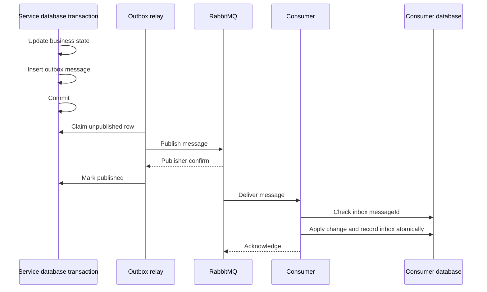

# Event-Driven Architecture

- **Status:** Approved target; implementation not started
- **Last updated:** 2026-09-09
- **Decision:** [ADR-0009](adr/0009-redis-rabbitmq-microservices.md)

## Message roles

- A **command** asks one logical consumer to perform work: `ai.generate-next-step.v1`.
- An **event** records a fact that has happened and may be consumed independently: `focus.session-completed.v1`.
- A **query** remains synchronous HTTP and does not travel through RabbitMQ.

## Standard envelope

```json
{
  "messageId": "uuid",
  "type": "focus.session-completed.v1",
  "schemaVersion": 1,
  "occurredAt": "2026-09-09T12:00:00Z",
  "producer": "core-service",
  "correlationId": "uuid",
  "causationId": "uuid",
  "subject": { "type": "user", "id": "internal-user-id" },
  "payload": {}
}
```

Message names and payloads are immutable within a version. A breaking change creates a new version and a compatibility window.

## Delivery semantics

The system provides at-least-once delivery, not exactly once. Consumers must tolerate duplicates and out-of-order delivery.



An outbox relay uses bounded batches and safe row claiming. A consumer acknowledges only after its durable transaction commits.

## Retry and dead letters

- Classify errors as transient, permanent or unknown.
- Retry transient errors with bounded exponential backoff and jitter.
- Reject invalid schema, revoked authorization context and non-recoverable provider responses without endless retry.
- Route exhausted messages to a service-owned DLQ.
- DLQ replay requires an operator, a recorded reason and confirmation that the cause is fixed.
- Preserve original `messageId`; create a replay identifier in metadata rather than disguising a duplicate as a new business fact.

## RabbitMQ topology

```text
beneath-pine.commands exchange
├── ai.generate queue
├── engagement.evaluate-return queue
└── notification.deliver queue

beneath-pine.events exchange
├── engagement.focus-events queue
├── analytics.product-events queue
├── ai.result-events queue
└── notification.delivery-events queue

service-owned retry queues and DLQs
```

Consumers that must each see an event use separate queues. Competing instances of the same consumer share one queue.

## Privacy and security

- Never include user access tokens, service credentials or provider secrets.
- Exclude raw Brain Dump, reflection, note, task title and notification copy by default.
- Use opaque internal subject and entity identifiers.
- When private content is required, send a reference and let an authorized worker retrieve it through a narrow internal API.
- Apply retention and access controls to queues, DLQs, traces and broker logs.

## Redis responsibilities

Redis stores only reconstructable or expiring state:

```text
gateway:rate-limit:{subject}:{route}
gateway:idempotency:{key}
ai:job-progress:{jobId}
ai:provider-limit:{provider}
engagement:lock:reminder-scheduler
```

Each key is service-owned and namespaced. Relevant keys have TTLs. Services never use another service's Redis keys as an integration API. Durable job, consent and business state remains in PostgreSQL.
