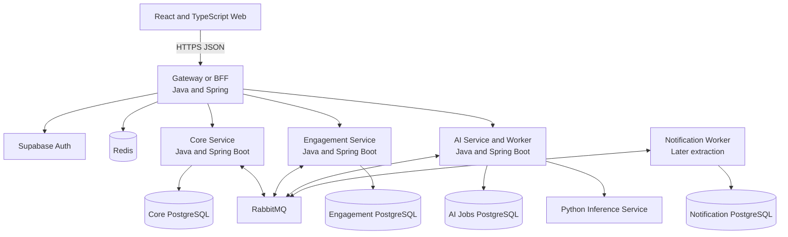

# Target Microservices Architecture

- **Status:** Approved target; not the current runtime
- **Last updated:** 2026-09-09
- **Decisions:** [ADR-0008](adr/0008-java-spring-backend-migration.md), [ADR-0009](adr/0009-redis-rabbitmq-microservices.md)

## Current and target states

The repository now has a React client and a Java/Spring Core Service foundation. Former backend business routes are not running and must be rebuilt as vertical slices. The distributed target remains incremental; documentation must not describe a planned dependency or service as deployed.



## Service ownership

| Deployable | Owns | Must not own |
| --- | --- | --- |
| Gateway/BFF | Public routing, entry JWT verification, rate limiting, correlation IDs, response composition | Product rules, service databases, durable workflow state |
| Core Service | Profile, consent, tasks, next actions, focus sessions, habits, capture, account data rights | Reminder delivery, provider-specific AI execution |
| Engagement Service | Focus Seeds, return state, reminder preferences/schedules, Weekly Letter and feedback | Core task/focus records, external delivery credentials |
| AI Service/Worker | AI jobs, provider selection, retry, schema/safety validation and result state | User authentication source, core product entities |
| Notification Worker | External delivery attempts and provider responses | Reminder eligibility or product engagement policy |

The first production-shaped Java backend is the Core Service as a modular monolith. The first asynchronous extraction is AI processing; the first business extraction is Engagement. Notification stays inside Engagement until outbound delivery volume and failure isolation justify separation.

## Communication rules

- Use synchronous HTTP when the caller needs an immediate result or explicit validation response.
- Use RabbitMQ for durable work, fan-out events, retries and side effects that do not block the core request.
- Do not create long synchronous service chains. Prefer a local read model or event-fed projection.
- The browser communicates only with the Gateway/BFF and Supabase Auth.
- Every internal request carries service identity, correlation context and the minimum user subject context.

## Data ownership

The target is database-per-service. During migration, one Supabase PostgreSQL instance may host isolated schemas and roles:

```text
core.*
engagement.*
ai_jobs.*
notification.*
integration.*
```

Each service owns its migrations and is the only writer for its schema. Cross-service foreign keys, direct joins and repository access are prohibited. A service receives required facts through a versioned API or event and stores a minimal projection.

## Availability boundary

Core capture, task and focus behavior must remain usable when Redis, RabbitMQ, Engagement, notification or an AI provider is unavailable. Optional systems degrade independently:

- Redis failure becomes a cache miss or a controlled rate-limit degradation.
- RabbitMQ failure leaves messages in the transactional outbox.
- AI failure returns a safe deterministic fallback or a recoverable failed job.
- Engagement failure delays derived return/reminder state without corrupting the completed focus session.
- Notification failure cannot re-enable a disabled reminder.

## Extraction gates

A module becomes a deployable only when all gates are met:

1. Ownership of behavior and data is unambiguous.
2. Contracts and compatibility policy are versioned.
3. Independent failure or scaling creates real value.
4. Health, metrics, tracing, deployment and rollback exist.
5. No shared-table writes or distributed transaction is required.
6. Local development and integration tests remain reproducible.

## Delivery phases

| Phase | Result |
| --- | --- |
| 1 | Spring Boot foundation replaces the removed Node.js API skeleton |
| 2 | Task/focus vertical slice implemented in Core Service with one data writer |
| 3 | Redis for rate limiting, bounded idempotency, progress and locks |
| 4 | RabbitMQ, outbox/inbox and asynchronous AI Worker |
| 5 | Engagement Service consumes core events and owns engagement data |
| 6 | Notification extraction and full distributed observability if evidence supports it |
