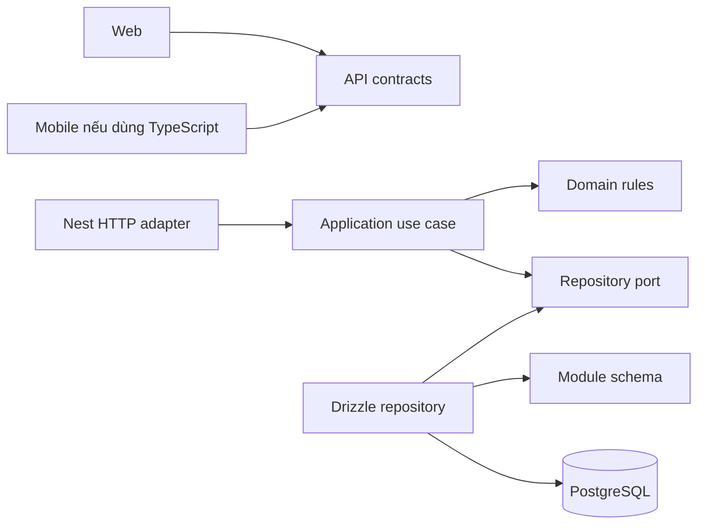

# Cấu trúc repository đích

- **Trạng thái:** Đã tạo `apps/api`; Core backend cũ đã được xóa sau khi lưu SQL baseline cần thiết.
- **Ngày:** 2026-09-11
- **Phụ thuộc:** [Phân tích kiến trúc](architecture-options.md); cây bên dưới thể hiện Core modular monolith và React Native + Expo đã được chọn.

## Cây thư mục đích

```text
apps/
  web/                       # React/Vite, client đầu tiên
  mobile/                    # React Native + Expo, giai đoạn sau API core
  api/                       # NestJS, API dùng chung
    src/
      main.ts
      app.module.ts
      modules/
        identity/
        task/
        profile/
        consent/
        focus/
        capture/             # thủ công
        engagement/
        reflection/          # facts/template
        habit/
        analytics/
        privacy/
        access/
      platform/
        config/
        database/
          database.module.ts # kết nối Drizzle; không gom mọi repository vào đây
        http/                # error mapping, request ID, validation
        security/            # adapter xác thực và guard dùng chung
        health/              # live và readiness kết nối DB
    drizzle.config.ts        # inventory schema của API; chỉ server/tooling đọc
    drizzle/                 # SQL migrations + metadata Drizzle, sau baseline review
    test/
services/
  inference-service/         # Python pilot hiện có, chưa nối vào API
packages/
  contracts/                 # API payload/runtime validation không phụ thuộc DB/framework
docs/
ml/
supabase/                    # lịch sử schema public; chưa chuyển quyền sở hữu
```

`apps/mobile/` là vị trí dành cho client mobile khi bắt đầu triển khai React Native + Expo; không tạo placeholder hay đưa vào pnpm workspace trước đó. Mobile thuộc TypeScript workspace khi được khởi tạo. Nếu sau này cần worker, chỉ bổ sung entry point/process khi duyệt slice worker; `services/` không mặc định chứa mọi domain module.

Chọn `apps/api` để thể hiện đây là backend sản phẩm dùng chung. `services/inference-service` giữ runtime Python và vai trò provider hiện có. Tên thư mục là quy ước; không khẳng định số service triển khai.

## Tổ chức một module có nghiệp vụ

```text
modules/task/
  task.module.ts
  presentation/              # Nest controller, request/response mapping
  application/               # use case; port repository khi cần tách persistence
  domain/                    # invariant và state transition thuần TypeScript
  infrastructure/
    task.schema.ts           # Drizzle schema thuộc task owner
    drizzle-task.repository.ts
```

Module nhỏ có thể bắt đầu với ít file hơn. Không bắt mọi module có bốn thư mục rỗng. Identity chứa chính sách tài khoản; platform/security chứa tích hợp HTTP/credential, không quyết định ai sở hữu task.

## Chiều phụ thuộc



Nest module composition nối adapter với use case. Domain không import Nest, Drizzle hoặc SDK provider. Application không import controller, HTTP request hoặc database table. Cross-module collaboration qua exported application contract; không dùng barrel để vô tình export schema/repository cho client.

API contract là tài liệu giao tiếp qua mạng. Database schema chứa persistence fields, password hash và index; không export nó sang web/mobile. Web và React Native + Expo có thể chia sẻ Zod schema; OpenAPI/schema và fixture vẫn giúp kiểm tra contract độc lập client. Không giả định dùng chung React DOM component với native UI.

## Vì sao chưa tạo các package khác

Không tạo `packages/database`: hiện chỉ API là owner database; package chung dễ khiến nhiều phần ghi cùng bảng. Không tạo `packages/ui` để ép web/native chung component. Chỉ tạo API client SDK dùng chung khi client thứ hai xuất hiện và cùng stack; trước đó adapter web hiện có là đủ.

Một monorepo hỗ trợ thay đổi contract cùng code trong một review, nhưng không làm mọi client được nâng cấp cùng lúc. Mobile đã phát hành vẫn cần tương thích API dù code nằm cùng repository.

## Hiện trạng sau khi dọn legacy

| Path | Trạng thái | Bước tiếp theo |
| --- | --- | --- |
| `apps/web` | Client web hiện có | Dùng API thật cho các slice đã hoàn thành; phân biệt demo |
| `apps/api` | Core NestJS duy nhất | Triển khai từng slice theo kế hoạch module |
| `docs/04-engineering/legacy-schema` | Một bản SQL V1–V3 để review baseline | So sánh database thực trước khi tạo Drizzle journal |
| `packages/contracts` | Contract Zod hiện có | Tách API DTO khỏi domain/persistence; thiết kế OpenAPI interoperability |

API hiện chỉ có module class/README và platform, chưa có các lớp nghiệp vụ trong ví dụ. Workspace, scripts và CI chỉ còn stack Node/pnpm. Kế hoạch database sau phải liệt kê baseline, kiểm tra và cách hoàn nguyên. Xem [kế hoạch module](module-delivery-plan.md) và [Drizzle và migration](drizzle-data-access.md).
