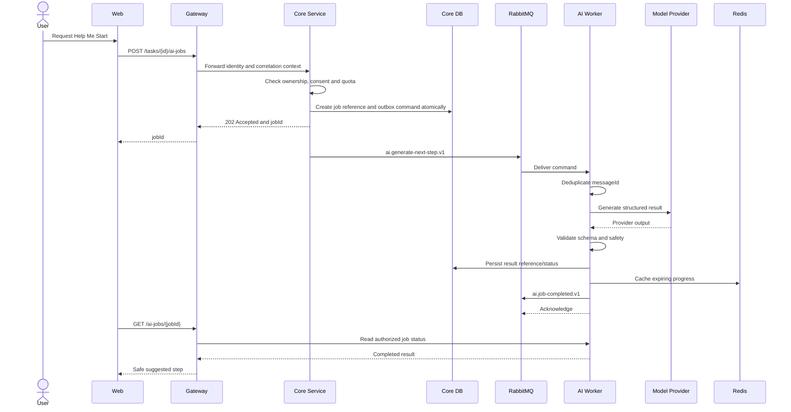

# Asynchronous AI Flow

- **Status:** Conditional future design; not an approved infrastructure sequence

Gateway, Redis, RabbitMQ and separate workers below are illustrative participants from the earlier distributed design. They are not dependencies required to build the shared NestJS/Drizzle API. Review [Architecture Options](../architecture-options.md) before implementing this flow.

If RabbitMQ is unavailable, the outbox retains the command. If the provider is unavailable, the worker applies bounded retry and then records a safe failure or deterministic fallback. Redis loss cannot erase job state.
