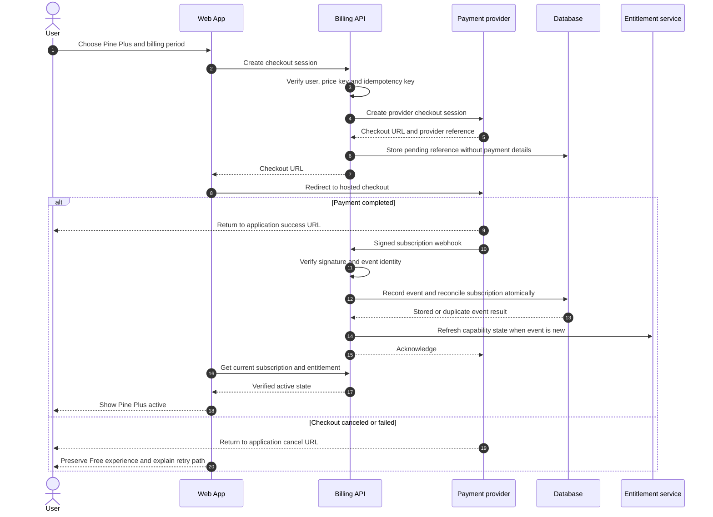
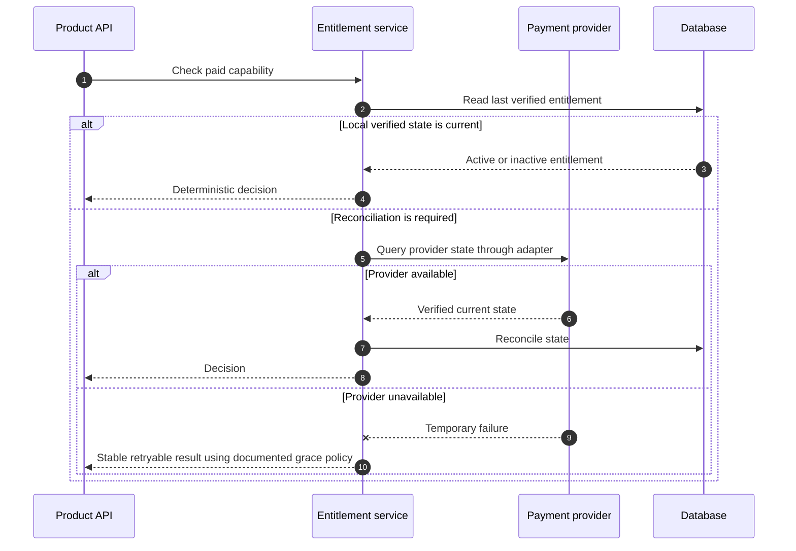

# Commercial Flow — Future Sequence Diagrams

- **Related capabilities:** `T5-ENTITLEMENT-01`, `T5-BILLING-01`, `T5-SYNC-01`, `T5-REMINDER-01`, `T5-INSIGHT-01`
- **Status:** Future boundary for paid validation; no provider selected

## 1. Capability entitlement check

```mermaid
sequenceDiagram
    autonumber
    actor U as User
    participant W as Web App
    participant API as Capability API
    participant Ent as Entitlement service
    participant DB as Database

    U->>W: Request a capability
    W->>API: Request with authenticated identity
    API->>Ent: Authorize capability for user
    Ent->>DB: Read plan, verified subscription state and policy
    alt Core or Free capability
        Ent-->>API: Allowed
        API-->>W: Execute capability
    else Plus capability and entitlement active
        Ent-->>API: Allowed with entitlement version
        API-->>W: Execute capability
    else Plus entitlement inactive
        Ent-->>API: Upgrade required with stable capability code
        API-->>W: Upgrade context; preserve user data and current session
        W-->>U: Explain value and available plan
    end
```

The API is authoritative. The Web may use bootstrap entitlement state for presentation, but it cannot grant access by itself.

## 2. Checkout and webhook reconciliation



The success redirect is not proof of payment. Only verified provider state changes entitlement. Replayed webhooks return success without applying the transition twice.

## 3. Cancel, expire and restore

```mermaid
sequenceDiagram
    autonumber
    actor U as User
    participant W as Account Settings
    participant API as Billing API
    participant Pay as Payment provider
    participant DB as Database
    participant Ent as Entitlement service

    U->>W: Cancel renewal
    W->>API: Cancel at period end
    API->>Pay: Update subscription
    Pay-->>API: Verified cancel-at-period-end state
    API->>DB: Persist state and current access end
    API-->>W: Access remains until verified end time
    W-->>U: Show end date and restore option

    alt User restores before end
        U->>W: Restore renewal
        W->>API: Restore subscription
        API->>Pay: Remove scheduled cancellation
        Pay-->>API: Verified active renewal
        API->>DB: Persist restored state
        API-->>W: Restored
    else Provider reports period ended
        Pay->>API: Signed subscription-ended webhook
        API->>DB: Reconcile ended state idempotently
        API->>Ent: Remove paid capability grants
        Note over Ent,W: Keep user-created presets/data readable or exportable; define edit limits before launch
        API-->>Pay: Acknowledge
    end
```

## 4. Provider failure boundary



The grace policy, refund policy, tax/invoice behavior and provider are open decisions that require evidence and an ADR before real payments are enabled.
