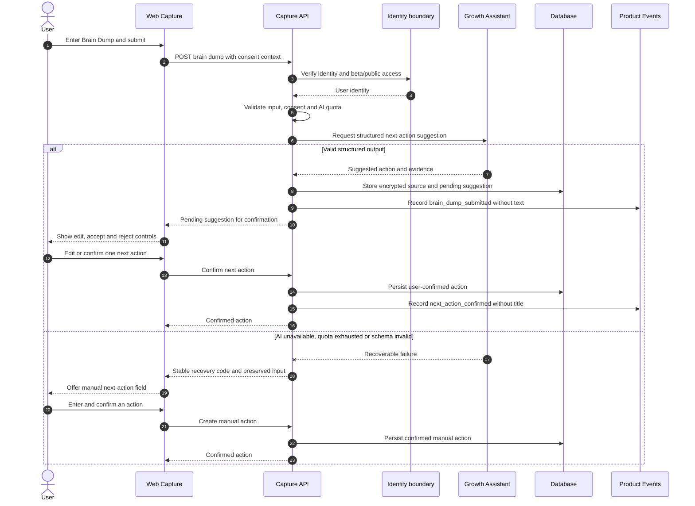
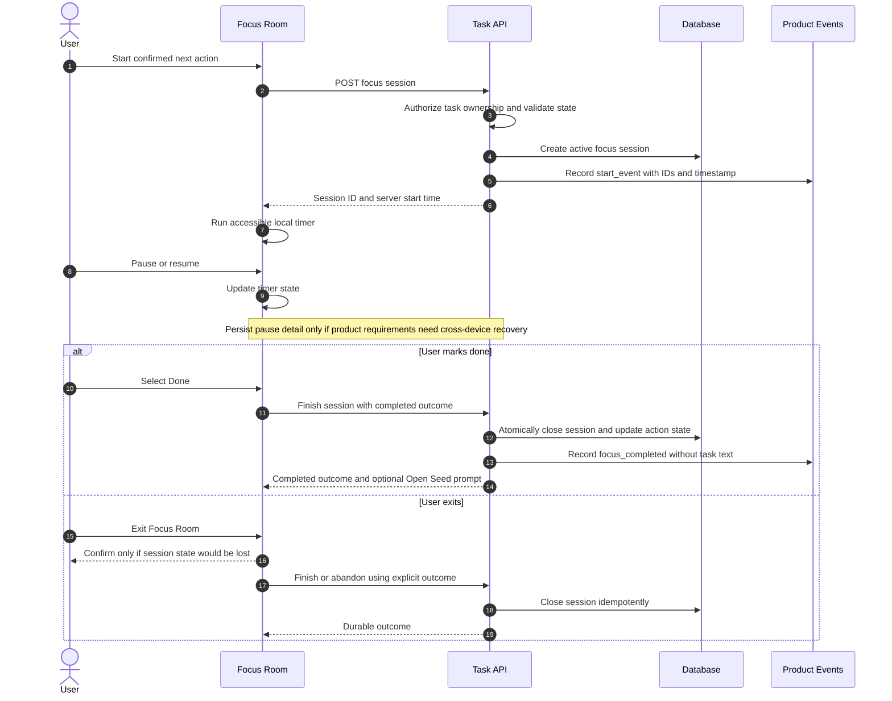
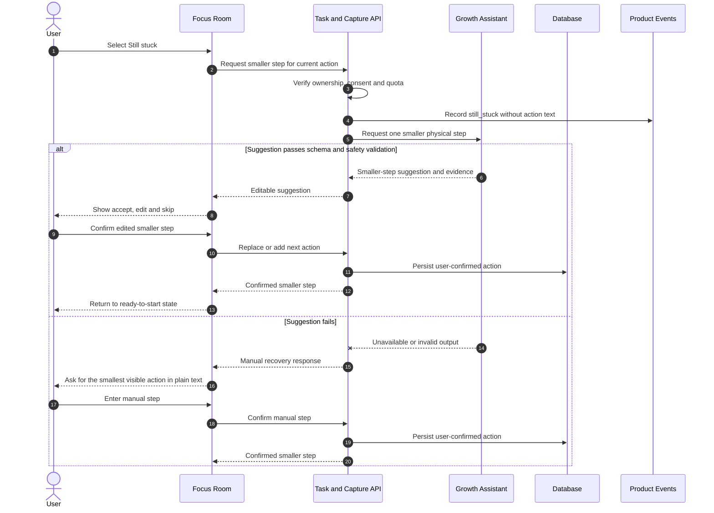

# Core Focus Flow — Sequence Diagrams

- **Related capabilities:** `T1-CAPTURE-01`, `T1-AI-01`, `T1-ACTION-01`, `T1-FOCUS-01`, `T1-STUCK-01`, `T1-EVENTS-01`

## 1. Brain Dump with manual recovery

The API does not log Brain Dump or action text. A failed suggestion never removes the user's input or blocks manual progression.

## 2. Focus session lifecycle

Client time drives display; server timestamps and state transitions provide durable session truth. Repeated finish requests return the same terminal result.

## 3. Still-stuck recovery

