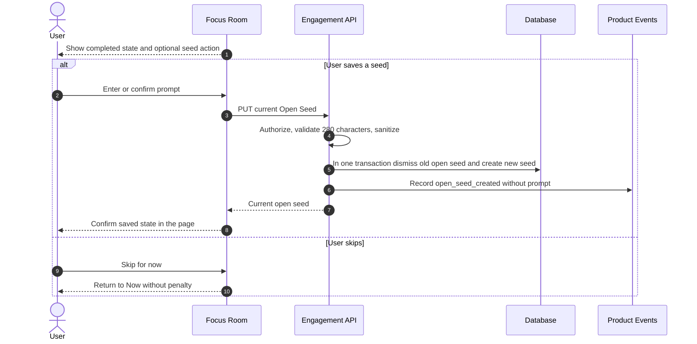
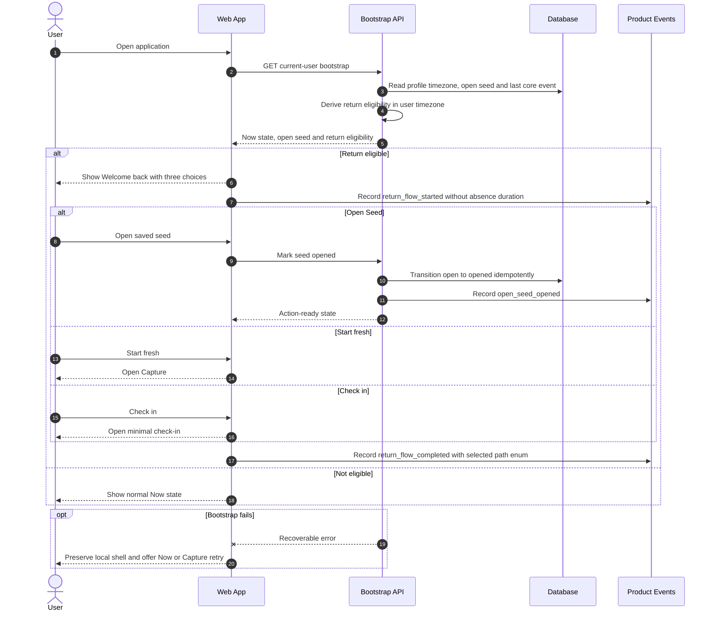
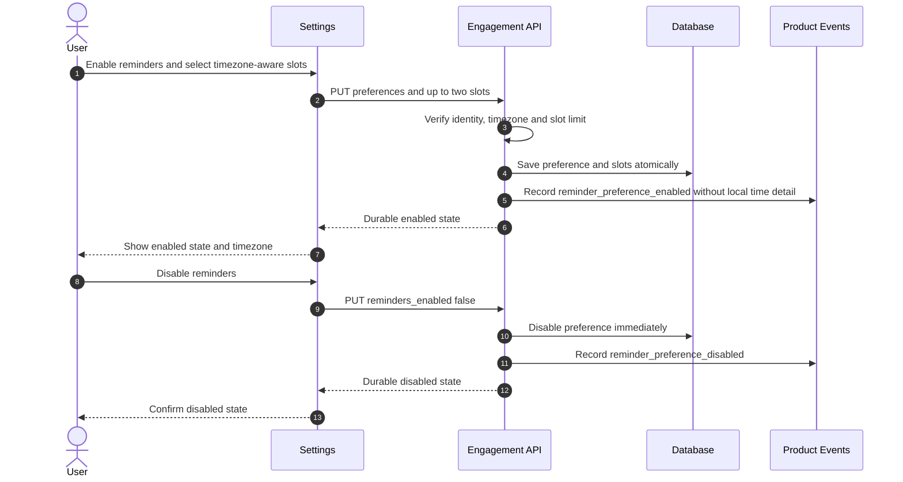
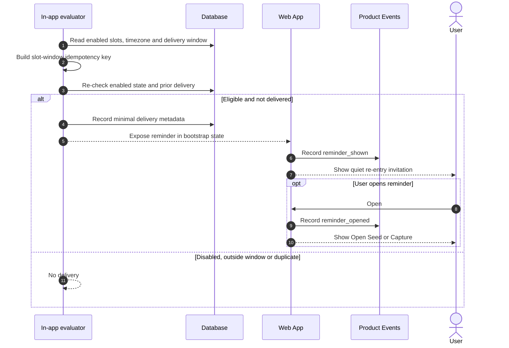
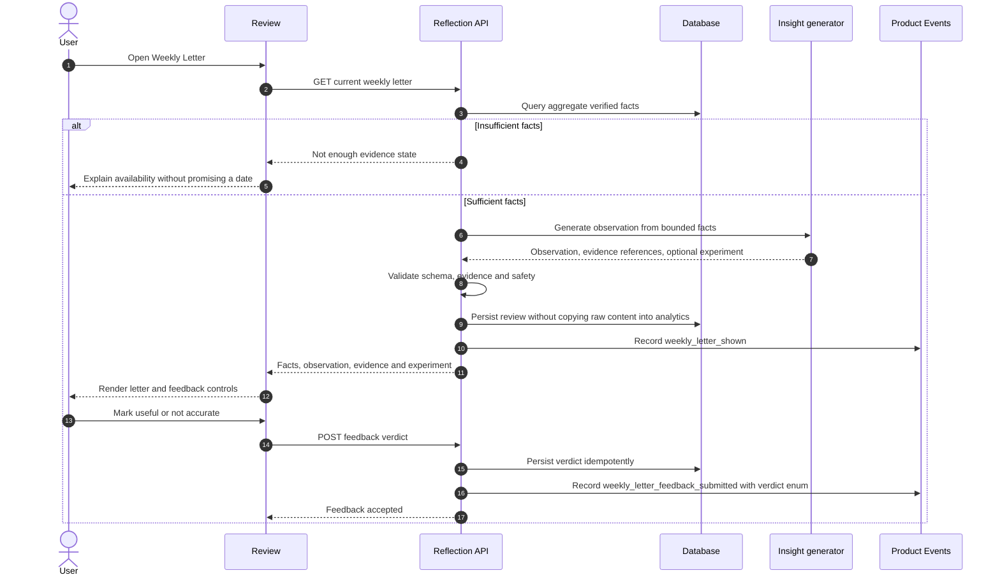

# Gentle Return Flow — Sequence Diagrams

- **Related capabilities:** `T2-SEED-01`, `T2-RETURN-01`, `T2-RETURN-02`, `T2-REMINDER-01`, `T2-EVENTS-01`, `T4-REFLECT-01`

## 1. Complete focus and leave an Open Seed

## 2. Bootstrap and Return Ritual

## 3. Configure and disable an in-app reminder

## 4. Evaluate an in-app reminder

## 5. Weekly Letter with evidence

