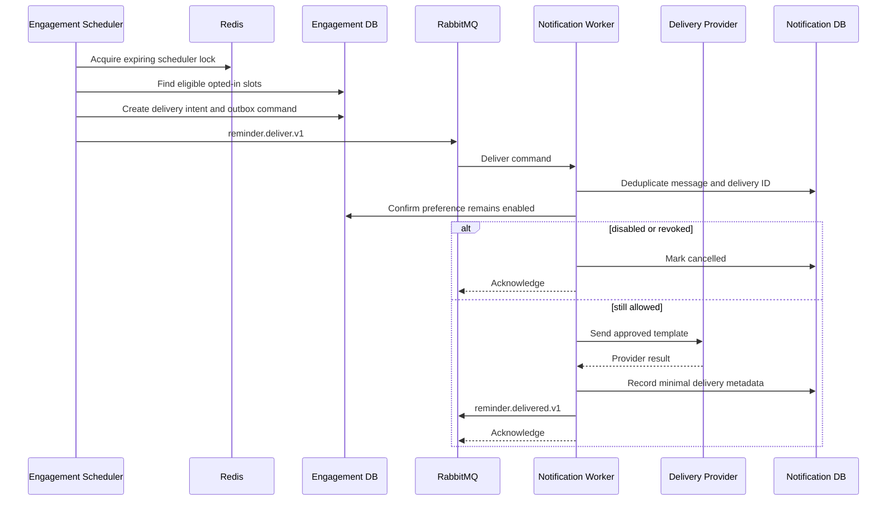

# Reminder Delivery Flow

- **Status:** Conditional future design; not an approved infrastructure sequence

Gateway, Redis, RabbitMQ and separate workers below are illustrative participants from the earlier distributed design. They are not dependencies required to build the shared NestJS/Drizzle API. Review [Architecture Options](../architecture-options.md) before implementing this flow.

Preference is checked again at delivery time. A queued message never overrides opt-out. Transient provider failures use bounded retry; permanent or exhausted failures enter a DLQ without message body or private user content.
