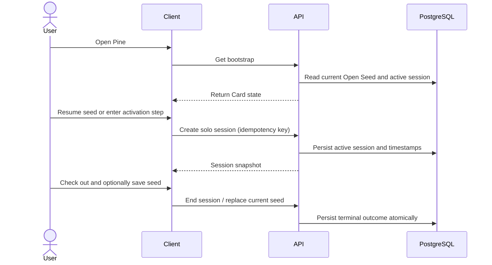

# Solo Return Flow

```mermaid
sequenceDiagram
  actor U as User
  participant C as Client
  participant API as API
  participant DB as PostgreSQL
  U->>C: Open Pine
  C->>API: Get bootstrap
  API->>DB: Read current Open Seed and active session
  API-->>C: Return Card state
  U->>C: Resume seed or enter activation step
  C->>API: Create solo session (idempotency key)
  API->>DB: Persist active session and timestamps
  API-->>C: Session snapshot
  U->>C: Check out and optionally save seed
  C->>API: End session / replace current seed
  API->>DB: Persist terminal outcome atomically
```
