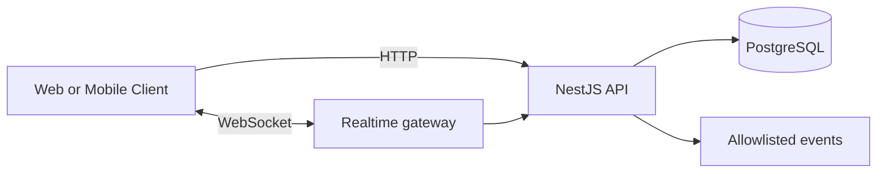
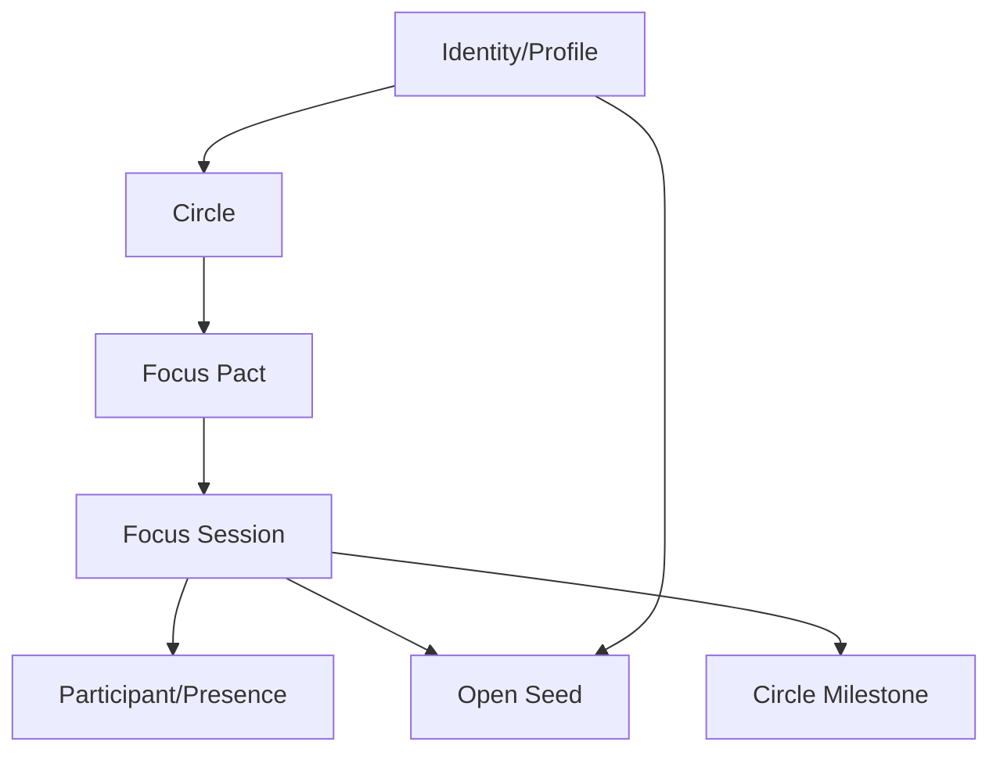

# System Diagrams

```mermaid
flowchart LR
  C[Web or Mobile Client] -->|HTTP| API[NestJS API]
  C <-->|WebSocket| RT[Realtime gateway]
  API --> D[(PostgreSQL)]
  RT --> API
  API --> A[Allowlisted events]
```

```mermaid
flowchart TD
  I[Identity/Profile] --> C[Circle]
  C --> P[Focus Pact]
  P --> S[Focus Session]
  S --> X[Participant/Presence]
  S --> O[Open Seed]
  S --> M[Circle Milestone]
  I --> O
```
