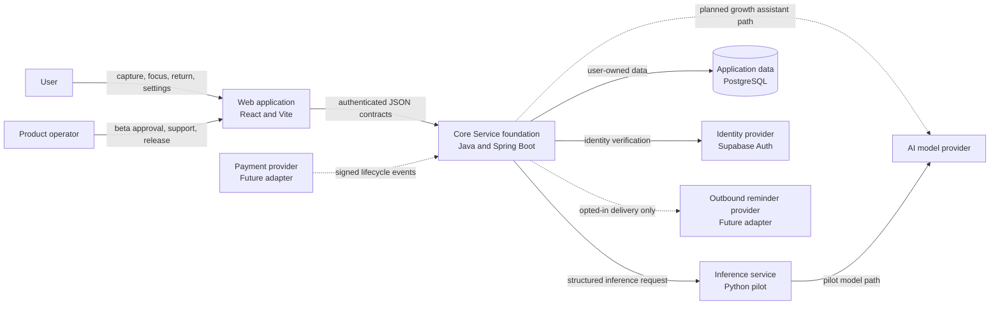
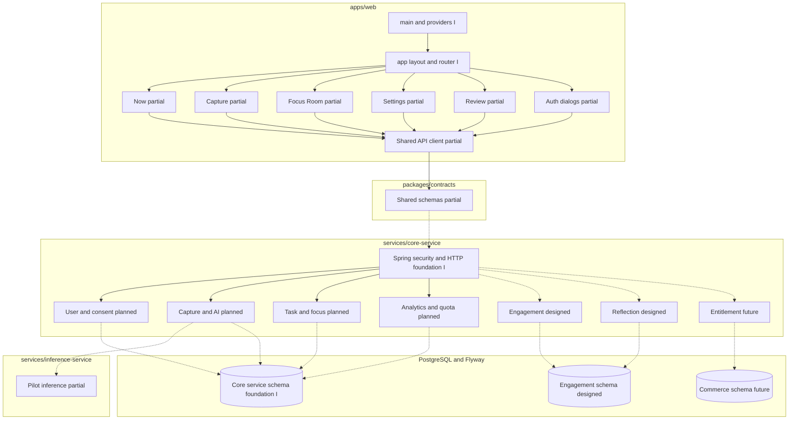
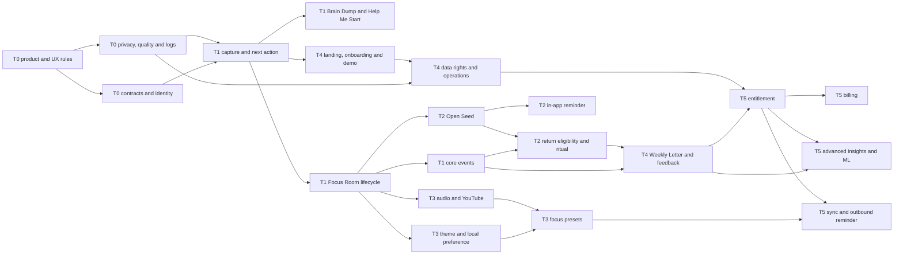
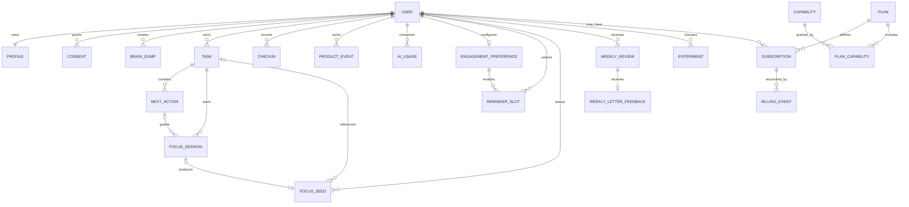
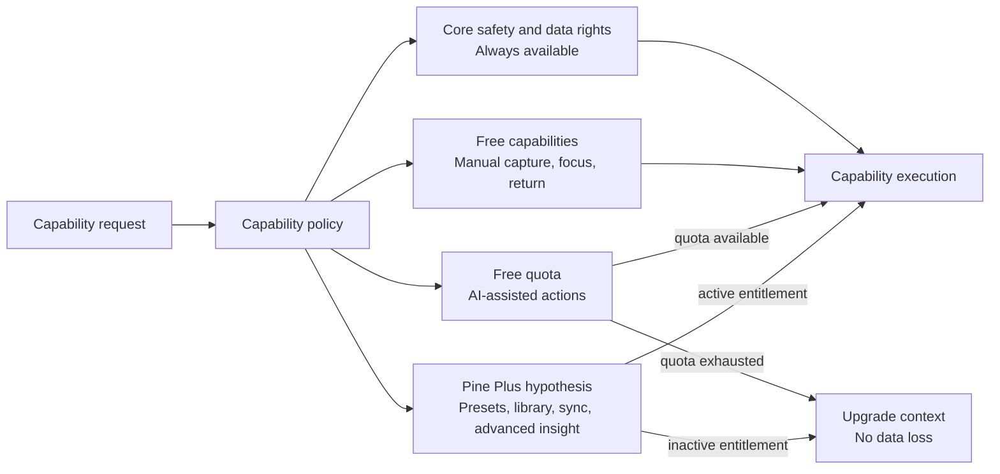

# System Diagrams — Public Focus Companion

- **Status:** Draft aligned with PRD 1.0
- **Last updated:** 2026-09-09
- **Legend:** `[I]` implemented, `[P]` partial, `[D]` designed, `[N]` planned, `[F]` future

These diagrams describe logical boundaries and dependencies. They do not prescribe server sizing, database capacity, deployment topology or a payment provider.

The first diagrams below distinguish the implemented Java foundation from product behavior that still needs backend reimplementation. The approved Redis/RabbitMQ deployment target is documented separately in [Target Microservices Architecture](microservices-architecture.md); it is not yet implemented.

## 1. System context

The Web and API own the product experience. Identity, model, payment and outbound services are external processors behind explicit boundaries. Dashed relationships are future capabilities.

## 2. Runtime components and ownership

## 3. Capability dependency graph

## 4. Domain relationship model

Core entities exist in retained Supabase migration history but are not yet mapped into the Java service. Engagement relationships are designed and require migration/RLS delivery. Commerce entities are Tier 5 concepts and must not be introduced before paid validation.

## 5. Entitlement relationship

Entitlement belongs at the application boundary and is enforced by the API for paid capabilities. UI checks improve presentation but are not authorization. Focus sessions already in progress, user-created data and data-rights actions remain accessible regardless of plan state.

## 6. Diagram-to-implementation index

| Need | Canonical detail |
|---|---|
| Capability scope and gate | [Tiered Delivery Plan](../02-product/tiered-delivery-plan.md) |
| Core focus runtime behavior | [Core Focus Sequences](sequences/core-focus-flow.md) |
| Seed, return, reminder and letter behavior | [Gentle Return Sequences](sequences/gentle-return-flow.md) |
| Entitlement and billing behavior | [Commercial Sequences](sequences/commercial-flow.md) |
| Endpoint payloads for retention | [Engagement API Contract](../ai/contracts/engagement-api.md) |
| Logical data rules | [Data Model](data-model.md) |
| Safety/privacy invariants | [Privacy by Design](../06-security-privacy/privacy-by-design.md) |
| Java migration and target services | [Target Microservices Architecture](microservices-architecture.md) |
| RabbitMQ, outbox/inbox, retry and Redis | [Event-Driven Architecture](event-driven-architecture.md) |
| Planned integration messages | [Event and Command Catalog](event-catalog.md) |
