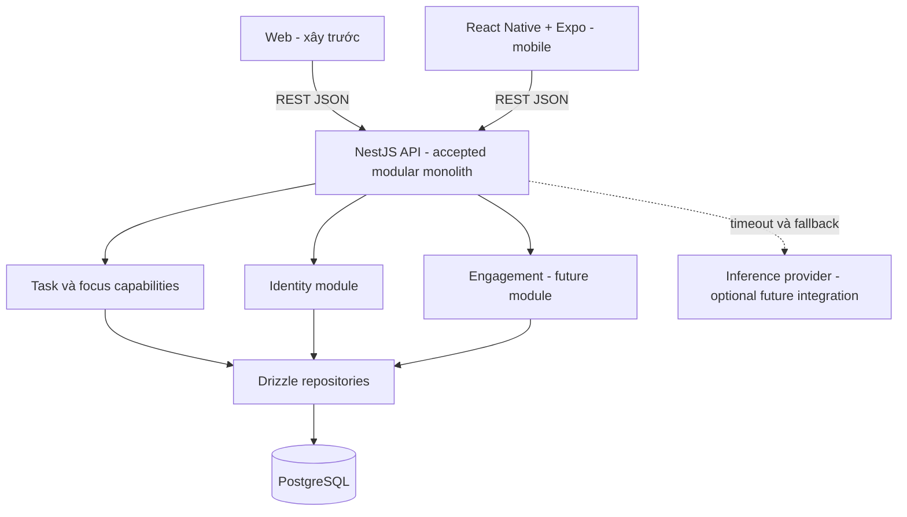
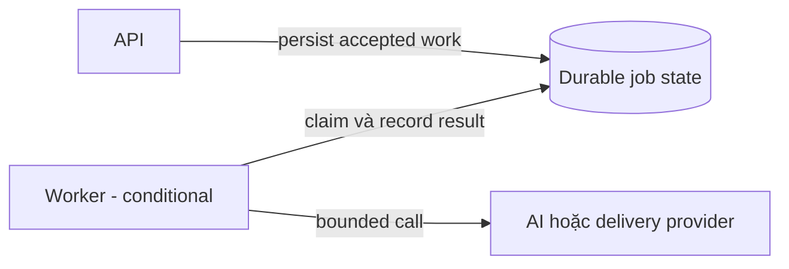

# System Diagrams

- **Ngày:** 2026-09-11
- **Nhãn:** implemented = đã có code; draft = code đang dở; accepted = đã chốt kiến trúc, chưa đồng nghĩa triển khai; future = chưa cam kết.

## Hiện trạng

Web và bản nháp API hiện có chưa được chuyển hoàn chỉnh sang cấu trúc đích. Drizzle/mobile chưa triển khai; inference pilot chưa có caller từ Core. Không có dual-write được cho phép.

## Kiến trúc đã chốt: một API cho hai client

Mobile đã chọn React Native + Expo; credential transport chưa được chọn. Mũi tên dùng chung API không khẳng định cùng auth adapter, không kéo theo gateway hoặc service riêng.

## Chỉ khi có nhu cầu job bền vững

Chưa chọn queue/broker hay triển khai worker. Worker cùng application ownership chưa phải microservice độc lập. Khi tách domain service phải thiết kế lại quyền ghi, contract, recovery và migration.

Capability tier, entitlement và domain model vẫn nằm ở [PRD](../02-product/prd.md), [Tiered Delivery Plan](../02-product/tiered-delivery-plan.md) và [Data Model](data-model.md). Các [sequence diagrams](sequences/README.md) cho tính năng tương lai không thay thế trạng thái implementation tại đây.
